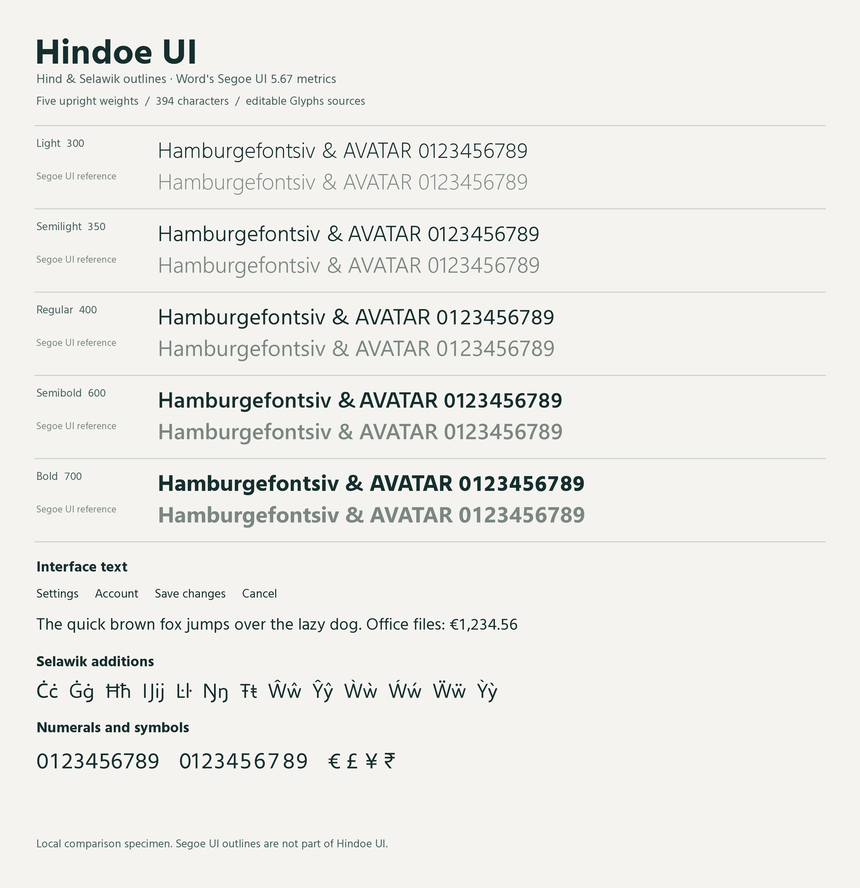

# Hindoe UI

Hindoe UI combines the letterforms of [Hind](https://github.com/itfoundry/hind)
with additional characters from [Selawik](https://github.com/microsoft/selawik),
adjusted to closely match Segoe UI's horizontal proportions, spacing, and
kerning while retaining Hind's character.

Version **1.019** includes five upright weights, **399 glyphs**, and
**394 encoded characters**, covering Latin text, symbols, and numerals.

## Fonts

The installable TrueType fonts are in [`dist/ttf/`](dist/ttf/).

| Weight | Weight class | TTF | Editable source |
| --- | ---: | --- | --- |
| Light | 300 | [Download](dist/ttf/HindoeUI-Light.ttf) | [Glyphs](sources/glyphs/HindoeUI-Light.glyphs) |
| Semilight | 350 | [Download](dist/ttf/HindoeUI-Semilight.ttf) | [Glyphs](sources/glyphs/HindoeUI-Semilight.glyphs) |
| Regular | 400 | [Download](dist/ttf/HindoeUI-Regular.ttf) | [Glyphs](sources/glyphs/HindoeUI-Regular.glyphs) |
| Semibold | 600 | [Download](dist/ttf/HindoeUI-Semibold.ttf) | [Glyphs](sources/glyphs/HindoeUI-Semibold.glyphs) |
| Bold | 700 | [Download](dist/ttf/HindoeUI-Bold.ttf) | [Glyphs](sources/glyphs/HindoeUI-Bold.glyphs) |

Medium is omitted to match the reference's weight set. There are no italic or
oblique styles. Download the TTF files and open them in your operating system's
font installer.

## Editing in Glyphs

Each file in [`sources/glyphs/`](sources/glyphs/) is a complete document for one
weight, including cubic outlines, an export instance, editable kerning, and
shaping features. Use these documents for static exports. The sources passed
the Glyphs 4 native parser and static export round-trip checks.

[`HindoeUI-OutlineMasters.glyphs`](sources/HindoeUI-OutlineMasters.glyphs) groups
all five outline masters for comparison and editing. Their separate feature
texts are retained as round-trip data. Some contour structures differ between
masters, so this document is **not a variable font source**.

## Design and coverage

Weights are matched to Segoe UI by stem thickness. Horizontal refinements move
outline points and their handles, preserving stroke proportions and the
character of the original curves. Hind's slightly sloping capital M sides
remain. Version 1.018 refines the Bold D and B bowls and makes the Bold e
crossbar 10% thinner, including its accented forms.

Selawik supplies 44 additional characters and the ampersand. Hind supplies the
other outlines. Version 1.019 removes the additional Devanagari letters,
marks, conjuncts, punctuation, and shaping data. It retains the ten Devanagari
digits **०१२३४५६७८९** (U+0966–U+096F), matching the Devanagari coverage in
Word's Segoe UI. Minimal script records preserve the digits' text-shaping
behavior. The full Segoe UI character repertoire is not reproduced.

All fonts use 2,048 units per em. The 393 encoded characters shared with the
reference have matching advance widths. Kerning is present in both GPOS and
legacy kern tables. Latin mark attachment follows the reference's positioning
with adjustments for the retained accent shapes. The repertoire reduction
preserves every remaining outline, advance width, anchor, and kerning pair.

The reference is Segoe UI **5.67;O365**, from Microsoft Word 16.112.2. Paragraph
comparisons across all five weights verified matching line breaks, glyph
origins, and line advances for the tested text.

## Provenance and licensing

Licensed under the SIL Open Font License 1.1 — see
[`LICENSE.txt`](LICENSE.txt).

Hind is copyright 2014 Indian Type Foundry. Selawik is copyright 2015 Microsoft
Corporation, with the Reserved Font Name Selawik. Both upstream projects use
the SIL Open Font License 1.1; their notices and license texts are retained in
[`licenses/`](licenses/).
